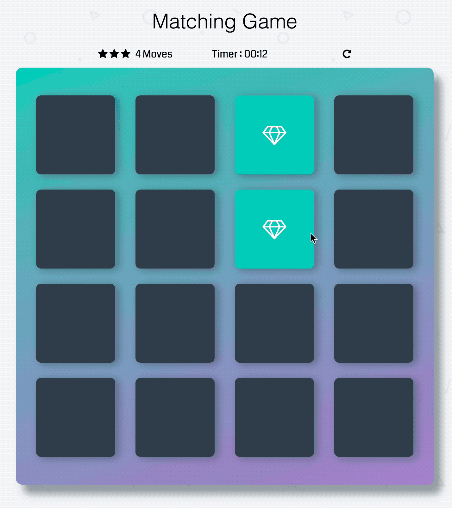
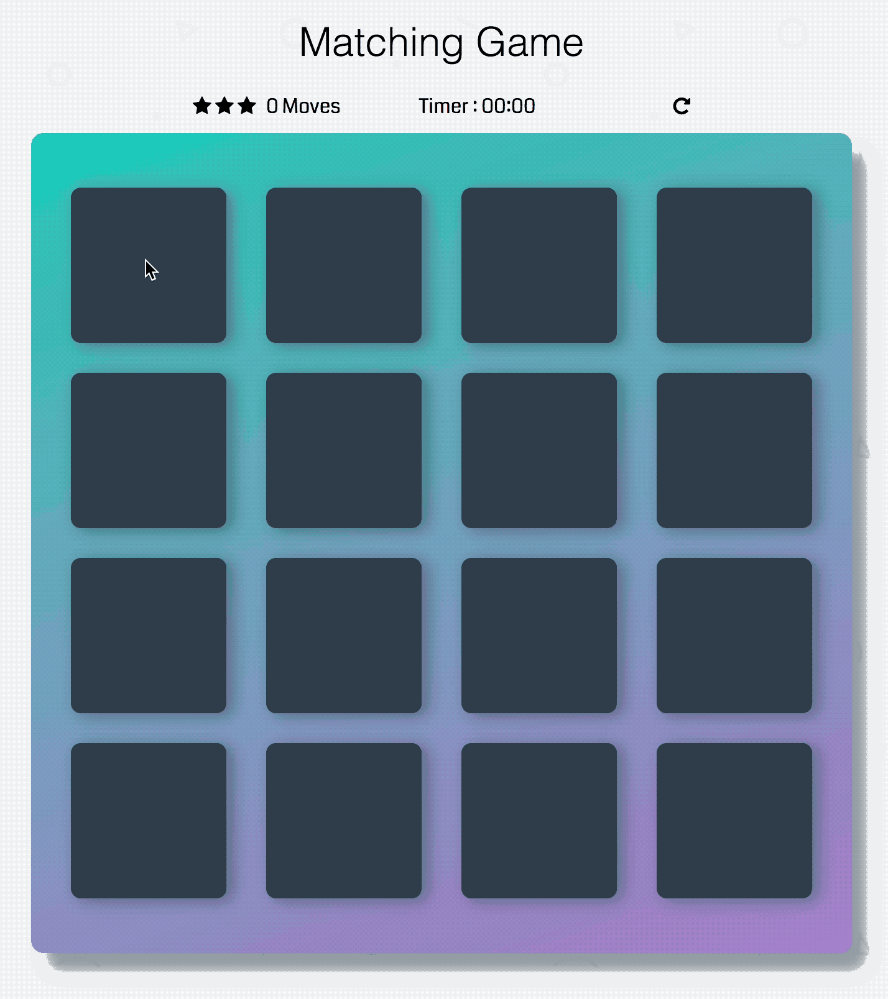
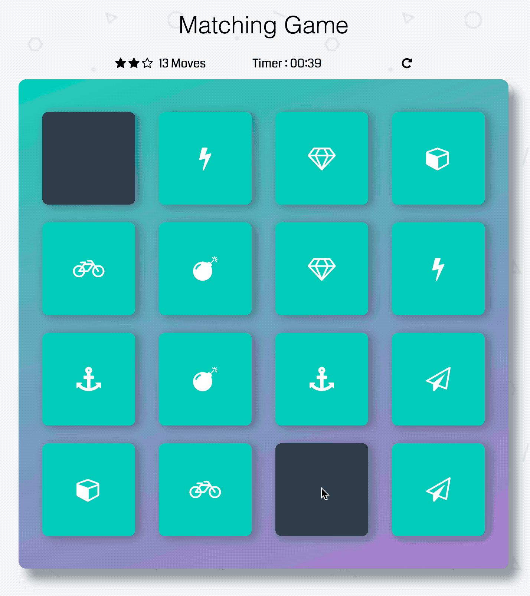

# Memory Game Project

## Table of Contents

* [Instructions](#instructions)
* [Functionality](#functionality)
* [Contributing](#contributing)

## Instructions

This is a memory game project which is implemented by native JavsScript, css animation and Font Awsome icons.

## Functionality

1. Once the page is opened or refreshed, 8 pairs of identical cards positioned randomly in the 16 blocks.
2. Click one card to show its icon, then click another to compare them. If the cards are identical, they keep showing until the game to be finished. The timer begins working no matter which card is clicked first.

    

3. Otherwise, the unmatched cards display for 1 second with red background and shaking animation to indicate the wrong guess, then disappear.

    

1. After the game is finished, the final tally page shows the statistics of your performance.

    

## Attribution

<!-- * Shuffle array function: [Stack Overflow](http://stackoverflow.com/a/2450976) -->
* Shuffle array function: <a href="http://stackoverflow.com/a/2450976" target="_blank">Stack Overflow</a>
* Flip animation: [CSS-Tricks](https://codepen.io/team/css-tricks/pen/ebb6b5a5cec86aa04168f03e26c7501c)
* Shaking animation: [CSS-Tricks](https://css-tricks.com/snippets/css/shake-css-keyframe-animation/)
* Success animation: [Istiak Tridip](https://codepen.io/istiaktridip/pen/BZqaOd)

## Contributing

Feel free to pull your request.